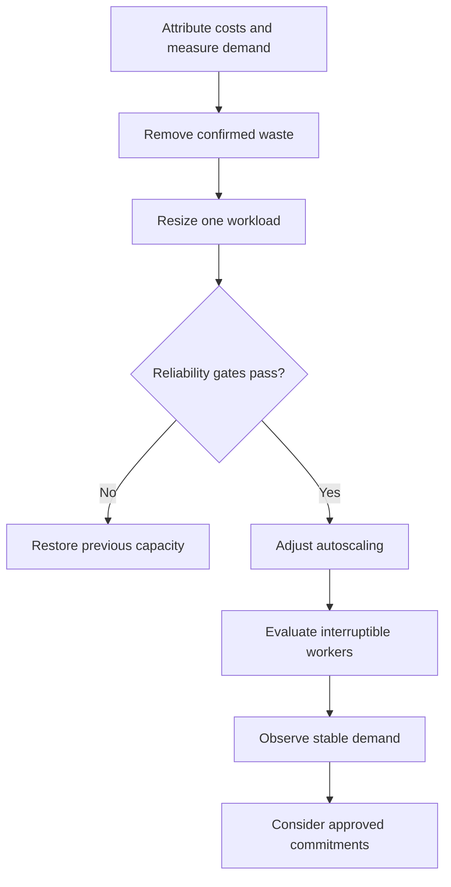

# Reducing cloud costs without weakening reliability

> **Illustrative engineering scenario.** The workload, budget, targets, and failure below are fictional. This is a design walkthrough, not an account of an employer's infrastructure or a deployed experiment. Currency amounts are synthetic estimates, not vendor quotes or measured savings.

**Summary:** I would reduce waste first, resize against workload evidence second, and change purchasing models last. A cheaper deployment only qualifies as an improvement if it still meets the service's reliability and recovery requirements.

## The scenario and ownership

Assume a commerce service on AWS with a customer-facing API, a managed database, background workers, and staging environments. Traffic is quiet overnight and rises during campaigns. Workers produce reports from durable queue messages; interrupted jobs can be retried using a stable job identifier and an idempotent output write.

The illustrative API target is 99.9% successful valid requests over a rolling 30-day window, with p95 latency below 500 ms measured separately. The worker target is a queue age below five minutes during normal operation. These are proposed requirements to negotiate with product owners, not universal defaults.

I own capacity analysis, infrastructure changes, cost attribution, and rollback. Application owners confirm safe retries, memory behavior, and dependency limits. Finance owns the budget and any long-term commitment. Product agrees on campaign capacity and which staging hours developers need. Database resizing requires its owner's review; a low CPU graph alone is insufficient evidence.

## Establish a baseline before changing anything

Collect a representative month covering a campaign, releases, and ordinary demand. Attribute spend by service, environment, and owner; keep unattributed spend visible rather than assigning it arbitrarily. Relate the bill to completed requests and jobs, since a smaller total bill can simply mean less business activity.

Alongside costs, inspect CPU peaks, memory working sets, throttling, restarts, database connections, storage I/O, queue age, and replica counts. Average CPU does not capture memory pressure or a brief traffic spike. Check existing commitments before deleting capacity: reducing usage covered by a prepaid commitment might not reduce cash spend immediately.

Use this invented estimate to make the arithmetic inspectable:

| Monthly category | Baseline units | Proposed units | Rationale |
|---|---:|---:|---|
| API compute | $1,200 | $950 | Resize after capacity validation |
| Worker compute | $700 | $450 | Demand-based capacity; limited Spot eligibility |
| Non-production | $400 | $200 | Agreed schedules and idle resource removal |
| Database | $1,000 | $1,000 | Preserve capacity until separate analysis |
| Other services | $700 | $700 | Storage, networking, and observability unchanged |
| **Total** | **$4,000** | **$3,300** | **Hypothetical reduction: 17.5%** |

The units are dollars of estimated monthly spend. The percentage is `(4000 - 3300) / 4000`; it is not my CV's professional cost-reduction claim. The worker estimate is combined and must not be counted again as separate autoscaling and Spot savings.

## Sequence the decisions

First, schedule disposable staging workloads outside agreed development hours. Make manual reactivation straightforward. Remove abandoned resources only after checking ownership and dependencies. Snapshots, logs, volumes, and backups have retention or recovery purposes; age alone is not permission to delete them.

Second, change one API resource profile at a time. Set a minimum replica count that can handle the loss of one node under expected traffic. Preserve rollout headroom and watch database concurrency as replicas increase. Compare a representative subset with unchanged replicas before widening the change. If requests are used as a utilization denominator, changing them also changes the autoscaler's interpretation of load; inspect both settings together.

Third, tune worker capacity against backlog age and drain rate. Set a maximum that the database and downstream APIs can sustain. Keeping the queue durable does not guarantee timely delivery, so a low-cost configuration that misses the queue-age target fails acceptance.

## Choose where interruptions are acceptable

I would keep a reliable On-Demand floor and initially make only retry-safe workers eligible for Spot. The API stays on the established capacity model until there is evidence supporting a different choice. Diversify eligible instance choices, budget for replacement capacity, and allow an explicit On-Demand fallback when Spot capacity is unavailable.

Workers stop accepting new jobs while draining, checkpoint where useful, and acknowledge queue messages only after a durable result. Graceful interruption handling is helpful but cannot be the correctness mechanism: abrupt failures must also be safe. AWS describes a two-minute notice for stop/termination, an immediate hibernation exception, and best-effort notice delivery. [AWS interruption notices](https://docs.aws.amazon.com/AWSEC2/latest/UserGuide/spot-instance-termination-notices.html)

Buying a commitment first is the alternative I would reject here. It can lock in oversized demand. Savings Plans exchange discounted eligible compute usage for an hourly spending commitment over one or three years; they do not remove the obligation when usage falls. Finance should consider only a conservative stable baseline after optimization. [AWS Savings Plans](https://docs.aws.amazon.com/savingsplans/latest/userguide/what-is-savings-plans.html)

## A failure that would reverse the change

Suppose a campaign arrives faster than new API replicas become ready. Latency breaches the illustrative threshold and failures rise, while the resized pods show CPU throttling. Scaling also increases database connections. Adding replicas without checking that dependency could deepen the incident.

Freeze cost changes and appoint an incident owner. Compare release timing, capacity changes, pod health, connection usage, and user-facing signals. Restore the previous resource profile and replica floor through the recorded deployment configuration. Protect the database with bounded concurrency; restore worker capacity or pause nonessential jobs if they compete with checkout. Communicate customer impact and preserve the timeline. These are proposed response steps, not an executed recovery.

## Acceptance and limits

Before accepting a change, require representative peak-load checks, adequate failover headroom, acceptable API errors and latency, worker completion within target, and correct retries after abrupt termination. Keep the previous configuration and verify the restoration procedure. Observe through an agreed campaign cycle before declaring the proposal successful.

Compare billed cost per completed unit at comparable demand, include fallback and retry costs, and reconcile forecasts with actual invoices. Monitor budget variance alongside reliability signals. A projected saving becomes a result only after these checks produce evidence.

This design changes if jobs cannot be retried safely, demand lacks a stable baseline, data retention prevents deletion, or capacity replacement is too slow. In those cases, retain the relevant capacity and optimize elsewhere. The goal is lower cost for an agreed service level, with the reason for each retained expense visible.

---

[Back to the engineering writeup index](../../README.md#engineering-writeups)
