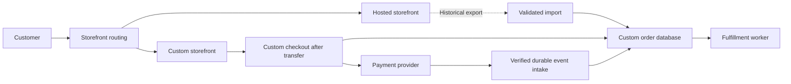

# Planning a cloud migration with a way back

> **Illustrative engineering scenario.** This fictional commerce migration explains my approach to planning and operational decisions. It does not describe an employer's architecture or incident. All targets and quantities are hypothetical; no deployment, rehearsal, or measured outcome is claimed.

## Summary

A successful migration preserves the ability to take, charge, and fulfill an order correctly. I would move browsing first, keep one checkout authority, and explicitly mark the point where returning to the old platform requires data reconciliation. A healthy homepage alone would never authorize the next stage.

## Scenario and ownership

Assume a retailer is replacing a hosted storefront with a custom application on AWS, a managed relational database, and a payment provider illustrated here with Stripe. The motivation is checkout customization and integration flexibility. Kubernetes is optional; the hosting choice is secondary to transaction correctness.

The hosted platform must support catalog exports, order/payment identifiers, a checkout freeze, and continued access to historical orders. Assume the retailer controls the payment account and can map existing transactions to orders. These are feasibility gates, not capabilities I would infer from a sales demo.

The application team owns checkout behavior and schema compatibility. Operations owns routing, capacity, monitoring, backups, and recovery coordination. Finance verifies payment reconciliation; fulfillment verifies shipment eligibility. A named incident lead can stop the cutover. The business owner approves the checkout interruption and communicates it to support.

## Architecture and alternatives

The diagram shows the transition. Before checkout transfer, the hosted platform writes orders; afterward, only the custom checkout accepts new orders. Historical hosted orders retain their original ownership until settled.

| Option | Decision |
| --- | --- |
| Switch everything in one maintenance window | Reject: too many independent failure modes become visible together. |
| Let both platforms accept orders and synchronize writes | Reject: conflicting inventory, duplicate fulfillment, and reverse-sync failures expand the recovery problem. |
| Stage browsing, then transfer checkout ownership during a short freeze | Choose: less seamless, but makes the writer and recovery boundary explicit. |

If checkout cannot be reliably disabled on the hosted platform, this approach is blocked. Routing changes cannot provide that guarantee.

## Staged cutover

**Prepare:** Inventory dependencies: domains, certificates, search redirects, authentication, tax, discounts, inventory, refunds, fulfillment, and payment callbacks. Preserve source IDs in imported records. Compare counts, monetary totals by currency, status distributions, and representative records; counts alone cannot detect wrong amounts. Confirm how active carts and sessions behave—an explicit cart reset is preferable to silently losing items.

**Move browsing:** Route a small, stable cohort to the custom storefront while every checkout still uses the hosted platform. Compare catalog freshness, search behavior, and request failures before expanding. Cohort assignment must persist across navigation. DNS weights would not provide session-level assignment; DNS caches also delay changes. Lower any relevant TTL in advance and wait out the previous TTL before relying on it. [AWS documents TTL caching and change tradeoffs](https://docs.aws.amazon.com/Route53/latest/DeveloperGuide/best-practices-dns.html).

**Transfer checkout:** Freeze new checkouts and administrative inventory writes. Drain in-flight requests and enumerate pending payments and fulfillment work. Capture the final export and reconcile it. Keep late payment events for pre-cutover orders assigned to their original owner; never reinterpret them as new custom orders. Enable custom checkout only after finance and fulfillment approve the handoff. Keep hosted checkout disabled even for customers reaching it through cached routes.

**Observe:** Keep staffing and support coverage through a hypothetical full day of normal demand and settlement checks. Track checkout attempts, successful payments, paid orders awaiting fulfillment, event backlog age, and inventory discrepancies. Retain historical order access and exports until business retention requirements and outstanding refunds are resolved.

## Consistency and payment safety

Create a durable pending order before initiating payment. Store its provider object ID and an opaque idempotency key for each logical payment operation. Retry an uncertain response with the same operation and parameters; do not create another payment because the browser timed out. Stripe retains idempotent results, including some errors, and may prune keys after at least 24 hours, so the internal order/payment mapping must outlive provider key retention. [Stripe's idempotency reference](https://docs.stripe.com/api/idempotent_requests).

Verify webhook signatures over the raw request body, durably record accepted events, and acknowledge promptly. Process asynchronously with atomic deduplication and guarded order-state transitions. Duplicate notifications must not create a second shipment; out-of-order notifications must not regress a settled payment. Reconcile ambiguous cases against the provider's current payment state. These choices account for Stripe's documented duplicate delivery and ordering behavior. [Stripe webhook guidance](https://docs.stripe.com/webhooks).

## Failure scenario and the rollback boundary

Suppose checkout responses are healthy, but paid orders remain pending because a worker release mishandles event payloads. The oldest unprocessed payment event crosses a hypothetical five-minute stop threshold.

1. Stop new checkout admission and pause fulfillment for affected orders. Keep authenticated event intake available so evidence is retained.
2. Identify affected orders using payment IDs and event records. Check delivery failures, worker errors, release version, and provider state; avoid logging card or customer data.
3. Roll back the compatible worker release, replay retained events, and reconcile payments to order and shipment records. Do not mark an event processed before its state change commits.
4. Resume checkout after backlog age recovers and finance confirms no unexplained paid orders or duplicate charges. Explain any customer impact through support.

Before any new payment or authoritative order mutation, routing can return to the hosted checkout after confirming the freeze left no unresolved requests. **After the first custom transaction, DNS rollback alone is unsafe.** Returning requires freezing custom writes, preserving its ledger, resolving pending payments, importing compatible order/inventory deltas, and validating them before reopening hosted checkout. If reverse import is unsupported, recover the custom stack forward and accept a longer interruption. Never restore a stale database over acknowledged orders.

## Acceptance criteria and limits

These are proposed checks, not completed test results:

- Every imported order preserves its source ID, currency, amount, and status; discrepancies block transfer.
- Timeout retries, duplicate callbacks, and reordered callbacks produce one valid payment transition and at most one fulfillment action.
- Invalid signatures are rejected; pending pre-cutover payments remain owned and reconcilable.
- Both cached and current routes respect the checkout freeze; the writer handoff has a timestamp and owner.
- Paid orders have a documented fulfillment or exception state, with no unexplained reconciliation differences.

This design accepts a checkout interruption and does not solve every hosted-platform limitation. Subscriptions, nontransferable customer credentials, gift balances, or unavailable payment exports could require a different migration boundary. The expected benefit is a smaller, explainable recovery problem; establishing that benefit in a real system would require rehearsals and observed evidence.

---

[Back to the engineering writeup index](../../README.md#engineering-writeups)
