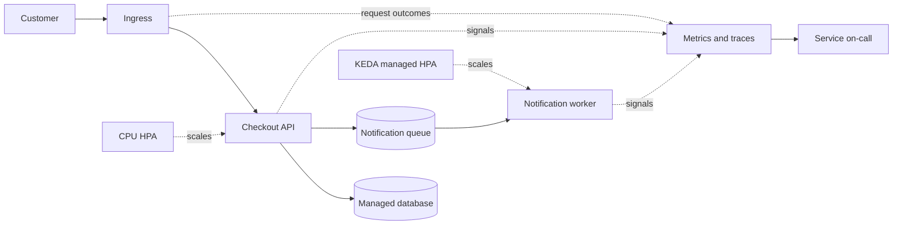

# Operating Kubernetes beyond successful deployments

> **Illustrative engineering scenario.** This is an original fictional design and response walkthrough, not an employer architecture, incident report, or executed experiment. Every workload figure and target below is hypothetical.

A successful rollout establishes that Kubernetes reached a desired state. It does not establish that customers can complete checkout. My approach starts with the user journey, then connects deployment controls, scaling, permissions, and recovery to that outcome.

## Scenario and ownership

Assume a commerce service with a synchronous checkout API, a managed database, and a separate worker processing queued notifications. Traffic varies during promotions. The API starts with three replicas spread across available zones; the worker can tolerate delayed processing.

Proposed targets are 99.9% successful eligible checkout requests over a rolling 30 days and 99% of eligible requests completing within one second. Eligibility excludes intentionally rejected authentication and validation requests, but includes service errors and dependency timeouts. Define this classification with product and application owners before relying on it. Queue age has a separate proposed target of under two minutes.

The application team owns transaction correctness, idempotency, health endpoints, and database compatibility. The platform team owns cluster capacity, deployment policies, and observability plumbing. Security reviews permissions and secret access. The service on-call owns mitigation, involving the database owner when evidence points there. These are distinct responsibilities even when one engineer wears several hats.

## Decisions before the first release

**Health checks have different jobs.** Readiness answers whether this instance can accept traffic; liveness answers whether restarting this process is a reasonable recovery action. A startup probe protects slow initialization before the other probes run. I would use a cheap process-local liveness check, never a database round trip: a shared dependency outage should not restart every instance. Readiness would reflect initialization and local ability to serve, with deliberate treatment of essential dependencies. Making every replica unready during a shared database fault can erase all serving capacity. [Kubernetes probe guidance](https://kubernetes.io/docs/tasks/configure-pod-container/configure-liveness-readiness-probes/)

**Scaling follows the bottleneck.** For this fictional API, start with CPU utilization HPA only if profiling establishes that CPU tracks useful throughput. Its utilization target is relative to CPU requests, not node capacity or container limits. A container using 300m against a 500m request is at 60% utilization. Missing relevant requests or missing metrics can prevent useful scaling decisions; inspect HPA conditions before blaming its threshold. Database-bound latency with low CPU calls for a different signal or dependency remediation, not a lower CPU target. [Kubernetes HPA mechanics](https://kubernetes.io/docs/concepts/workloads/autoscaling/horizontal-pod-autoscale/)

For the notification worker, queue depth and oldest-message age are more meaningful than CPU alone. KEDA is an option when event-source integration justifies the additional controller. It manages an HPA; I would not attach a second independent HPA to that worker. Bound concurrency and maximum replicas against downstream capacity, and retain retry limits and idempotency in the worker. Scaling consumers cannot make a broken downstream service healthy. [KEDA scaling and HPA ownership](https://keda.sh/docs/2.21/concepts/scaling-deployments/)

**Resources and access are explicit.** Choose requests from representative consumption evidence rather than copying another service. Set limits under the cluster's isolation policy and check CPU throttling alongside latency. Preserve node headroom for rollout surge; extra desired replicas do not imply available scheduling capacity.

Use separate runtime and deployment identities, namespace-scoped deployment permissions, and no runtime API token when the application does not call Kubernetes. Keep secret values out of Git, images, and logs; restrict retrieval and document rotation. Start with default-deny network policy, permitting ingress, DNS, database, queue, and telemetry paths as needed. Confirm that the CNI enforces those policies. A namespace alone is not a sufficient security boundary. [Kubernetes security checklist](https://kubernetes.io/docs/concepts/security/security-checklist/)

## Alert on customer impact

Record eligible request totals, failure totals, latency distributions, release identifiers, and dependency timings. Aggregate success counts across replicas; do not average their percentages. Infrastructure signals explain an incident but should not substitute for the checkout SLI.

For the hypothetical 99.9% success objective, 1% failures corresponds to ten times the permitted error fraction. Pair longer and shorter windows so sustained budget consumption pages on-call while a recovered spike clears promptly. Use a slower-burn ticket for gradual degradation. Exact thresholds depend on traffic and response time; low traffic makes ratios noisy, so combine journey checks and explicit outage detection instead of silently suppressing failures. Treat missing telemetry separately from zero errors. [Google SRE guidance on SLO alerting](https://sre.google/workbook/alerting-on-slos/)

## A fictional release failure

Suppose a release raises each API replica's database connection pool from 10 to 50. During surge, the combined pools exhaust database connection capacity. Pods still report healthy processes, while checkout requests time out. More API replicas could intensify the problem.

My response sequence would be:

1. Declare impact, freeze further releases, and identify affected checkout routes, release versions, and first-error time. Preserve events and representative traces before replacing pods.
2. Compare old and new configuration. Inspect pod readiness, restart reasons, resource pressure, HPA conditions, and pending pods to distinguish crashes, scheduling failure, and dependency saturation.
3. Check database connection counts and pool-wait time. Correlated pool exhaustion is a hypothesis to validate, not proof merely because a release occurred nearby.
4. If the pool change explains impact, revert the image and configuration through the deployment source of truth. Confirm database/schema compatibility first. Reconcile any emergency override with the normal deployment controller so it does not reapply the faulty revision.
5. Verify that excessive connections drain, then assess customer success and latency. Investigate ambiguous checkout outcomes using transaction identifiers and idempotency records; never blindly replay payments.
6. Assign prevention: a total connection budget covering maximum replicas plus rollout surge, configuration review, and a release gate observing customer outcomes.

## Evidence required and limits

Acceptance would require startup without premature restarts, removal of an unready replica from serving endpoints, denied unauthorized access, scaling without controller conflicts, and sufficient surge capacity. Recovery must restore request outcomes and reconcile ambiguous transactions, not merely turn pods green.

These are proposed verification criteria, not results. This design cannot establish replica counts, thresholds, or database capacity without workload evidence. It also assumes backward-compatible releases; destructive schema changes require a different recovery plan. I would reconsider CPU scaling when its correlation with demand fails, and introduce more sophisticated delivery controls only when release frequency or blast radius warrants them.

---

[Back to the engineering writeup index](../../README.md#engineering-writeups)
